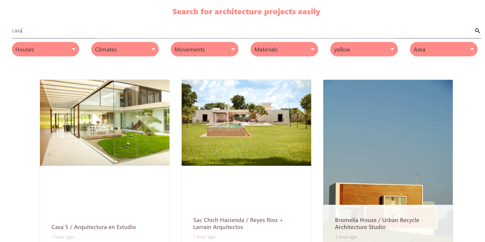

# Arch Reference - Django

Arch reference é um projeto cria em django que consome um crawler do site archdaily.com afim de fazer buscas com agrupamentos de filtros mais simples que são mais relevantes no dia a dia de estudantes de arquitetura na busca de referencias para seus projetos

